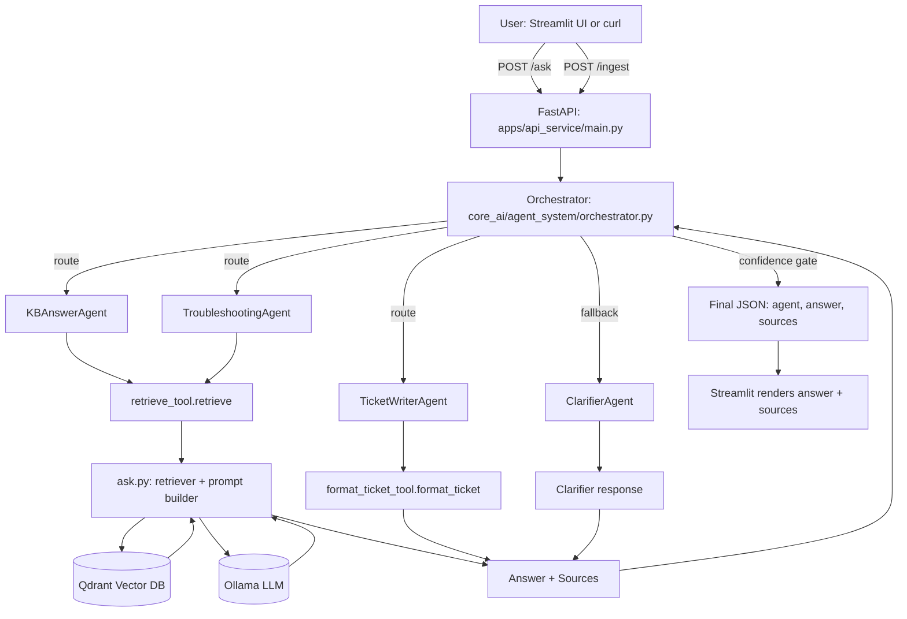

```mermaid
flowchart TD
  U[User: Streamlit UI or curl] -->|POST /ask| API[FastAPI: apps/api_service/main.py]
  U -->|POST /ingest| API

  API --> ORCH[Orchestrator: core_ai/agent_system/orchestrator.py]

  ORCH -->|route| KB[KBAnswerAgent]
  ORCH -->|route| TS[TroubleshootingAgent]
  ORCH -->|route| TW[TicketWriterAgent]
  ORCH -->|fallback| CL[ClarifierAgent]

  KB --> RT[retrieve_tool.retrieve]
  TS --> RT
  TW --> FT[format_ticket_tool.format_ticket]
  CL --> CLRESP[Clarifier response]

  RT --> ASK[ask.py: retriever + prompt builder]
  ASK --> QDRANT[(Qdrant Vector DB)]
  ASK --> OLLAMA[(Ollama LLM)]

  QDRANT --> ASK
  OLLAMA --> ASK

  ASK --> RES[Answer + Sources]
  FT --> RES
  CLRESP --> RES

  RES --> ORCH
  ORCH -->|confidence gate| FINAL[Final JSON: agent, answer, sources]
  FINAL --> UI[Streamlit renders answer + sources]
```
