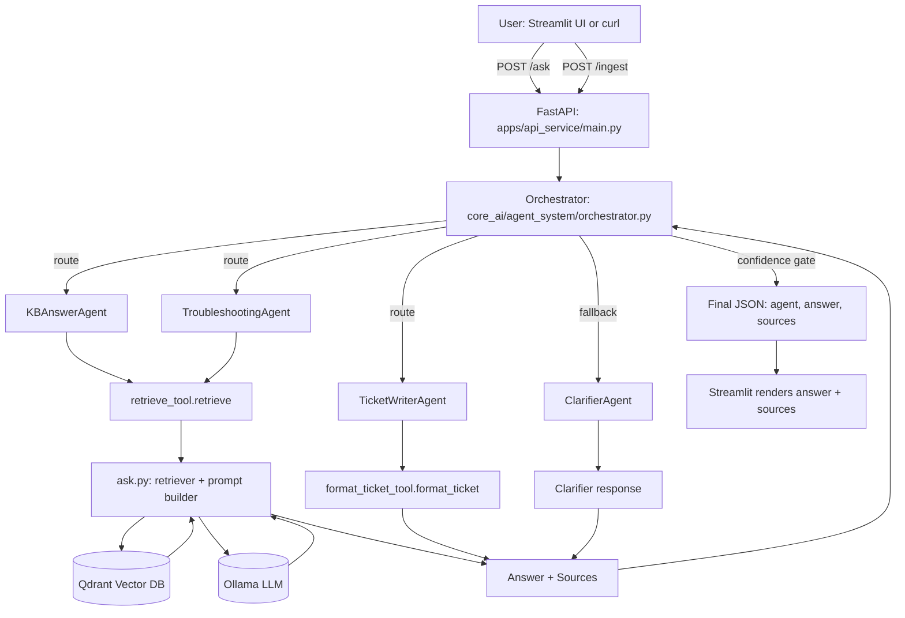

# Enterprise Knowledge Copilot

AI-powered internal assistant that delivers fast, accurate, hallucination-free answers from company documents (IT runbooks, HR policies, onboarding guides, troubleshooting manuals).

## Key Features

- 🔍 Semantic search across enterprise docs
- 🧠 Intelligent agent routing (KB, Troubleshooting, Ticketing, Clarification)
- 📄 Answers strictly grounded in retrieved content
- 🧾 Every response includes source citations
- ❓ Safe fallback when answer is unknown
- ⚙️ 100% local LLM (Ollama + Gemma/Qwen/etc.)

## How It Works

### RAG Pipeline
1. Retrieve relevant document chunks from Qdrant vector DB
2. Feed only retrieved context to the LLM
3. Generate precise, source-backed answer

## Technologies

| Technology              | Category              | Purpose                                                                 |
|-------------------------|-----------------------|-------------------------------------------------------------------------|
| Python 3.11             | Programming Language  | Core language for backend, AI pipeline, agents, and evaluation         |
| FastAPI                 | Web Framework         | Exposes REST APIs for ingestion and question answering                  |
| Streamlit               | Frontend Framework    | Interactive chat-based UI for users                                     |
| RAG                     | AI Architecture       | Ensures LLM answers are grounded in enterprise documents                |
| Vector Search           | Information Retrieval | Enables semantic similarity-based document search                       |
| Large Language Models   | AI Models             | Generate responses based on retrieved context                           |
| Docker                  | Containerization      | Ensures consistent runtime across environments                          |
| Git                     | Version Control       | Tracks source code and supports collaboration                           |

## 🛠️ Tools

| Tool                | Category             | Usage in Project                                          |
|---------------------|----------------------|-----------------------------------------------------------|
| LlamaIndex          | RAG Framework        | Document ingestion, indexing, retrieval, response synthesis |
| Qdrant              | Vector Database      | Stores and queries document embeddings                    |
| Sentence-Transformers | Embedding Model    | Converts documents into dense vector embeddings           |
| Ollama              | Local LLM Runtime    | Runs LLMs locally without cloud dependency                |
| Gemma / Qwen        | Language Models      | Generate answers from enterprise knowledge                |
| Uvicorn             | ASGI Server          | Runs FastAPI application efficiently                      |
| Requests            | HTTP Client          | Communicates between UI and backend                       |
| Pytest              | Testing Framework    | Executes automated test cases                             |
| Ruff                | Linter               | Enforces code quality and consistency                     |
| dotenv              | Configuration        | Loads environment variables securely                      |

## 🤖 Agents

| Agent Name            | Type              | Responsibility                                          |
|-----------------------|-------------------|---------------------------------------------------------|
| KB Answer Agent       | Knowledge Agent   | Answers factual questions using enterprise documents    |
| Troubleshooting Agent | Diagnostic Agent  | Provides step-by-step resolution for issues             |
| Ticket Writer Agent   | Automation Agent  | Converts issues into ITSM/JIRA-style tickets            |
| Clarifier Agent       | Safety Agent      | Requests clarification when confidence is low           |
| Agent Orchestrator    | Control Agent     | Routes questions to the appropriate agent               ||

### Safety Guardrails
Low confidence (similarity score, relevance, LLM signals) → switches to ClarifierAgent instead of guessing.

## Architecture

- **Frontend**: Streamlit chat UI
- **Backend**: FastAPI (`/ask`, `/ingest`)
- **AI Core**:
  - Sentence-transformers embeddings
  - Qdrant vector store
  - Ollama local LLM
  - Modular agent system + RAG

### Ingestion
Drop files in `data/raw_documents/` → `/ingest` → chunk → embed → index in Qdrant


### Related Questions

### Unrelated questions 


### Query Flow
Question → Orchestrator → Agent → Retrieve → LLM → Confidence check → Answer + sources





## Design Goals

- Zero hallucinations
- Fully source-grounded
- Modular & extensible
- Enterprise-safe
- Local-first (no cloud LLM)

## Use Cases

- IT helpdesk automation
- HR policy questions
- Onboarding support
- Internal doc search
- Guided troubleshooting

## Evaluation

Automated tests for:
- Agent selection
- Grounding accuracy
- Safe unknown handling
- Latency

```bash
python evaluation/run_eval.py
```


- Enterprise Knowledge Copilot: Production-ready, secure, local AI assistant built for accuracy and trust in real enterprise environments.

